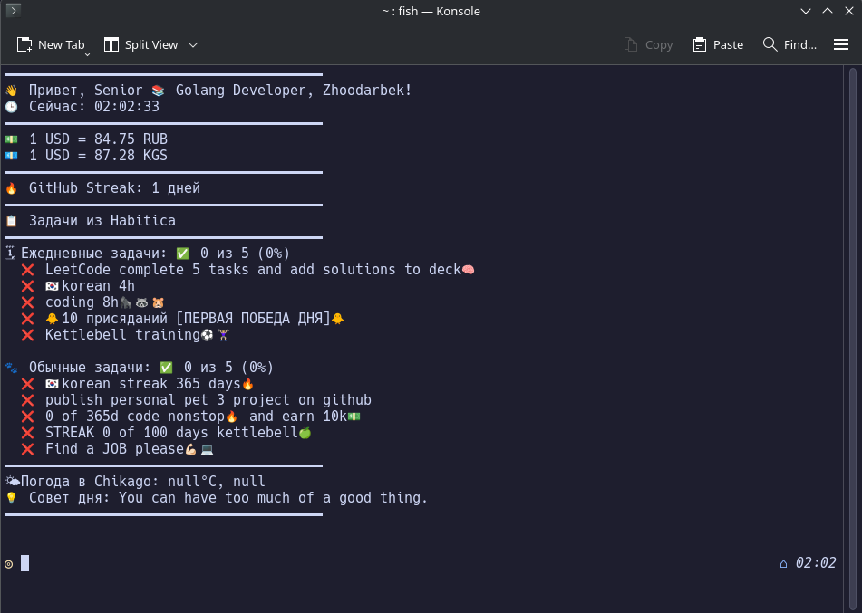
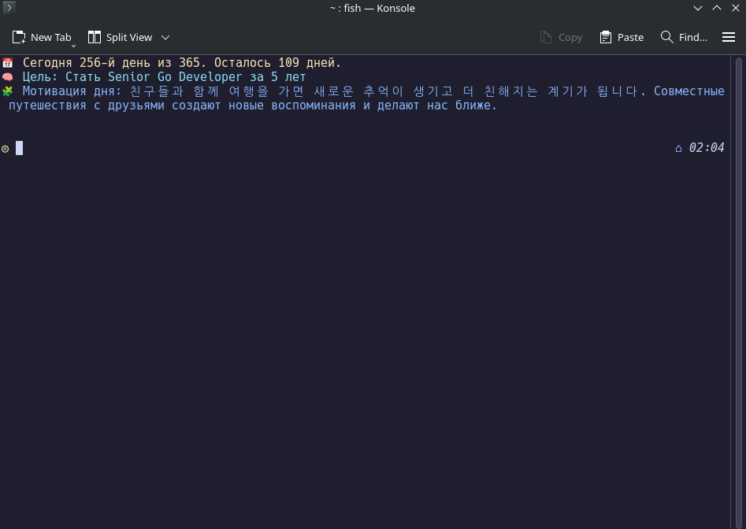

# 🐟 Fish Greeting Configuration

Personalized greeting for **Fish Shell** terminal that displays:

- Time and username
- Currency exchange rates
- Weather information
- Daily advice
- GitHub streak (if available)
- Duolingo streak
- Habitica tasks (`dailies` and `todos`)
- Minimal config for faster terminal startup


### Advanced Version



### Minimal Version  




---

## 🚀 Installation

### 1. Open the configuration file `config.fish`

```bash
nano ~/.config/fish/config.fish
```

Or choose a different path if you use a separate file for `fish_greeting`.

---

### 2. Install `jq` if not already installed:

#### 📦 Arch / Manjaro:

```bash
sudo pacman -S jq
```

#### 🐧 Debian / Ubuntu:

```bash
sudo apt install jq
```

#### 🍎 macOS:

```bash
brew install jq
```

---

### 3. Insert the following code into `config.fish`

## Advanced Theme

```fish
function fish_greeting
    set username "YOUR_GITHUB_USERNAME"
    set city "YOUR_CITY"
    set api_user "YOUR_HABITICA_USER_ID"
    set api_token "YOUR_HABITICA_API_TOKEN"
    set api_key "YOUR_OPENWEATHER_API_KEY"

    # Get name from GitHub
    set user_info (curl -s https://api.github.com/users/$username)
    set name (echo $user_info | jq -r '.name')

    # Get public events from GitHub
    set events (curl -s "https://api.github.com/users/$username/events/public")
    set streak_days 0
    set last_commit_date ""

    # Calculate streak based on events
    for event in (echo $events | jq -c '.[] | select(.type == "PushEvent")' 2>/dev/null)
        set commit_date (echo $event | jq -r '.created_at')
        
        if test -z "$last_commit_date"
            set last_commit_date "$commit_date"
            set streak_days 1
        else
            set prev_date (date -d "$last_commit_date" '+%Y-%m-%d' 2>/dev/null)
            set current_date (date -d "$commit_date" '+%Y-%m-%d' 2>/dev/null)
            set diff_seconds (math "(($(date -d "$commit_date" +%s 2>/dev/null) - $(date -d "$last_commit_date" +%s 2>/dev/null)) / 86400)" 2>/dev/null)
            if test "$diff_seconds" -eq 1
                set streak_days (math $streak_days + 1)
            else
                break
            end
            set last_commit_date "$commit_date"
        end
    end

    # Current time
    set current_time (date '+%H:%M:%S')

    # Currency rates
    set dollar_to_rub (curl -s https://api.exchangerate-api.com/v4/latest/USD | jq '.rates.RUB' 2>/dev/null || echo "N/A")
    set dollar_to_kgs (curl -s https://api.exchangerate-api.com/v4/latest/USD | jq '.rates.KGS' 2>/dev/null || echo "N/A")

    # Weather
    set weather (curl -s "http://api.openweathermap.org/data/2.5/weather?q=$city&appid=$api_key&units=metric&lang=en")
    set temperature (echo $weather | jq '.main.temp' 2>/dev/null || echo "N/A")
    set weather_desc (echo $weather | jq -r '.weather[0].description' 2>/dev/null || echo "Unavailable")

    # Daily advice
    set suggestion (curl -s https://api.adviceslip.com/advice | jq -r '.slip.advice' 2>/dev/null || echo "Today is a great day for coding!")

    # Habitica tasks with proper headers
    set habitica_headers "-H \"x-api-user: $api_user\" -H \"x-api-key: $api_token\" -H \"x-client: MyFishApp-YourName\""
    set habitica_response (curl -s -H "x-api-user: $api_user" -H "x-api-key: $api_token" -H "x-client: MyFishApp-YourName" https://habitica.com/api/v3/tasks/user)
    
    echo "━━━━━━━━━━━━━━━━━━━━━━━━━━━━━━━━━━━━━━━"
    echo "👋 Hello, Senior 📚 Golang Developer, $name!"
    echo "🕒 Current time: $current_time"
    echo "━━━━━━━━━━━━━━━━━━━━━━━━━━━━━━━━━━━━━━━"
    echo "💵 1 USD = $dollar_to_rub RUB"
    echo "💶 1 USD = $dollar_to_kgs KGS"
    echo "━━━━━━━━━━━━━━━━━━━━━━━━━━━━━━━━━━━━━━━"
    echo "🔥 GitHub Streak: $streak_days days"
    echo "━━━━━━━━━━━━━━━━━━━━━━━━━━━━━━━━━━━━━━━"

    # Check if Habitica data is available
    if test -n "$habitica_response" -a "$habitica_response" != "null" -a (echo "$habitica_response" | jq -e '.success == true' 2>/dev/null)
        echo "📋 Tasks from Habitica"
        echo "━━━━━━━━━━━━━━━━━━━━━━━━━━━━━━━━━━━━━━━"

        # Daily tasks
        set daily_tasks (echo $habitica_response | jq -c '.data[] | select(.type == "daily")' 2>/dev/null)
        if test -n "$daily_tasks"
            set total_daily 0
            set completed_daily 0
            
            for task in $daily_tasks
                set text (echo $task | jq -r '.text')
                set completed (echo $task | jq '.completed')
                set total_daily (math $total_daily + 1)
                if test "$completed" = "true"
                    set completed_daily (math $completed_daily + 1)
                end
            end

            set daily_percent (math "($completed_daily / $total_daily) * 100")
            echo "🗓 Daily tasks: ✅ $completed_daily of $total_daily ($daily_percent%)"
            
            for task in $daily_tasks
                set text (echo $task | jq -r '.text')
                set completed (echo $task | jq '.completed')
                if test "$completed" = "true"
                    echo "  ✅ $text"
                else
                    echo "  ❌ $text"
                end
            end
        else
            echo "🗓 Daily tasks: no tasks"
        end

        echo ""

        # Todo tasks
        set todo_tasks (echo $habitica_response | jq -c '.data[] | select(.type == "todo")' 2>/dev/null)
        if test -n "$todo_tasks"
            set total_todo 0
            set completed_todo 0
            
            for task in $todo_tasks
                set text (echo $task | jq -r '.text')
                set completed (echo $task | jq '.completed')
                set total_todo (math $total_todo + 1)
                if test "$completed" = "true"
                    set completed_todo (math $completed_todo + 1)
                end
            end

            set todo_percent (math "($completed_todo / $total_todo) * 100")
            echo "🐾 Todo tasks: ✅ $completed_todo of $total_todo ($todo_percent%)"
            
            for task in $todo_tasks
                set text (echo $task | jq -r '.text')
                set completed (echo $task | jq '.completed')
                if test "$completed" = "true"
                    echo "  ✅ $text"
                else
                    echo "  ❌ $text"
                end
            end
        else
            echo "🐾 Todo tasks: no tasks"
        end
    else
        echo "❌ Habitica: Failed to fetch data"
        echo "Check:"
        echo "  - API User ID and Token"
        echo "  - Internet connection"
        echo "━━━━━━━━━━━━━━━━━━━━━━━━━━━━━━━━━━━━━━━"
    end

    echo "━━━━━━━━━━━━━━━━━━━━━━━━━━━━━━━━━━━━━━━"
    echo "🌤 Weather in $city: $temperature°C, $weather_desc"
    echo "💡 Daily advice: $suggestion"
    echo "━━━━━━━━━━━━━━━━━━━━━━━━━━━━━━━━━━━━━━━"
end
```

---

## 🧠 Additional Information

- Get weather API key from: [OpenWeatherMap](https://openweathermap.org/api)
- Habitica API tokens can be found in [User Settings](https://habitica.com/user/settings/api)

--- 

## Minimal Theme

```fish
function fish_greeting
    set day (date +%j)        # Day of year
    set total 365             # Total days
    set left (math "$total - $day")  

    set_color yellow
    echo "📅 Today is day $day of $total. $left days remaining."

    set_color brcyan
    echo "🧠 Goal: Become Senior in 5 years"

    set_color blue
    # Array of motivational quotes
    set -l quotes \
        "봄이 되면 날씨가 따뜻해지고 나무에 꽃이 피기 시작합니다. In spring, the weather gets warm and flowers start to bloom on trees."\
        "여름에는 해가 길고 기온이 매우 높아서 사람들이 자주 바닷가로 갑니다. In summer, days are long and temperatures are high, so people often go to the beach."\
        "가을이 되면 나뭇잎이 노랗고 빨갛게 물들고 시원한 바람이 불기 시작합니다. In autumn, leaves turn yellow and red, and cool winds begin to blow."\
        "겨울에는 기온이 영하로 떨어지고 눈이 내려서 거리와 집이 하얗게 변합니다. In winter, temperatures drop below zero and snow falls, turning streets and houses white."\
        "오늘은 맑고 햇빛이 강해서 사람들이 공원에서 산책을 많이 합니다. Today is clear with strong sunlight, so many people are walking in the park."\
        "어제는 하루 종일 비가 와서 외출하기가 매우 불편했습니다. Yesterday it rained all day, making it very inconvenient to go out."\
        "이번 주말에는 날씨가 흐리고 비가 올 예정이라서 실내 활동을 계획하고 있습니다. This weekend, the weather is expected to be cloudy with rain, so I'm planning indoor activities."\
        "겨울 방학 동안에는 눈이 많이 와서 친구들과 눈싸움을 하며 즐거운 시간을 보냈습니다. During winter vacation, it snowed a lot and I had fun having snowball fights with friends."\
        "가을 저녁에는 하늘이 붉게 물들고 공기가 선선해서 산책하기에 아주 좋습니다. Autumn evenings have red skies and cool air, making them perfect for walks."\
        "봄에는 새로운 시작을 의미해서 많은 사람들이 기분이 좋아집니다. Spring symbolizes new beginnings, so many people feel happy."\
        "저는 부모님과 형, 그리고 강아지 한 마리와 함께 살고 있습니다. I live with my parents, older brother, and a dog."\
        "주말마다 우리 가족은 함께 저녁을 먹으며 하루 동안 있었던 일에 대해 이야기합니다. Every weekend, my family eats dinner together and talks about the day's events."\
        "내 친구 민수는 어릴 때부터 알고 지낸 사이로, 지금까지도 자주 만나고 연락합니다. My friend Minsoo is someone I've known since childhood, and we still meet and contact each other often."\
        "가족은 언제나 나를 지지해주고 힘들 때 옆에 있어줘서 큰 힘이 됩니다. My family always supports me and is by my side during tough times, which gives me great strength."\
        "명절이 되면 친척들이 모두 모여서 함께 맛있는 음식을 먹고 즐거운 시간을 보냅니다. During holidays, all relatives gather to eat delicious food and have a good time."\
        "친구들과 함께 여행을 가면 새로운 추억이 생기고 더 친해지는 계기가 됩니다. Traveling with friends creates new memories and opportunities to become closer."\
        "어머니는 매일 아침 따뜻한 아침밥을 차려주시고, 저는 항상 감사한 마음을 가지고 있습니다. My mother prepares warm breakfast every morning, and I'm always grateful."\
        "아버지는 내가 어려울 때 조용히 조언을 해주시는 분이라서 존경합니다. I respect my father because he quietly gives advice when I'm having difficulties."\
        "친한 친구와 솔직하게 대화를 나누면 마음이 편해지고 스트레스도 줄어듭니다. Having honest conversations with close friends eases the mind and reduces stress."\
        "가족은 내 삶에서 가장 소중한 존재이며, 함께할 수 있는 시간이 늘 감사하게 느껴집니다. Family is the most precious thing in my life, and I'm always grateful for time spent together."\
        "제 여동생은 긴 갈색 머리와 큰 눈을 가지고 있어서 사람들한테 자주 예쁘다는 말을 들어요. My younger sister has long brown hair and big eyes, so people often tell her she's pretty."\
        "나는 외모보다는 성격을 더 중요하게 생각하지만, 깔끔한 인상도 첫인상에서는 무시할 수 없다고 생각해요. I think personality is more important than appearance, but a neat appearance also matters for first impressions."\
        "그 사람은 키가 크고 말랐지만, 항상 옷을 잘 입어서 멋져 보여요. He is tall and thin, but always dresses well and looks cool."\
        "제 친구는 머리를 자주 염색하고 새로운 스타일을 시도해서 언제나 개성이 넘쳐요. My friend often dyes his hair and tries new styles, so he always has a strong personality."\
        "거울을 볼 때마다 피부가 좋아지도록 노력해야겠다는 생각이 들어요. Every time I look in the mirror, I think I should try to improve my skin."\
        "외모에 너무 집착하는 건 좋지 않지만, 자기 관리는 자신감에도 영향을 준다고 생각해요. It's not good to obsess over appearance, but self-care affects confidence."\
        "그녀는 자연스럽고 단정한 스타일을 선호해서 항상 단아하게 보여요. She prefers a natural and neat style, so she always looks elegant."\
        "어렸을 때는 외모에 신경을 많이 안 썼는데, 지금은 첫인상이 중요하다는 걸 느껴요. When I was young, I didn't care much about appearance, but now I feel first impressions are important."\
        "그 사람의 눈웃음이 정말 매력적이라서 처음 만났을 때 바로 기억에 남았어요. His eye smile was so attractive that I remembered him immediately when we first met."\
        "운동을 꾸준히 하면서 몸이 건강해지고 외모에도 긍정적인 변화가 생겼어요. Through consistent exercise, my body became healthier and my appearance improved positively."
    # Random quote index
    set -l rand (math (random) % (count $quotes) + 1)
    echo "🧩 Daily motivation: $quotes[$rand]"

    set_color normal
end
```

```
